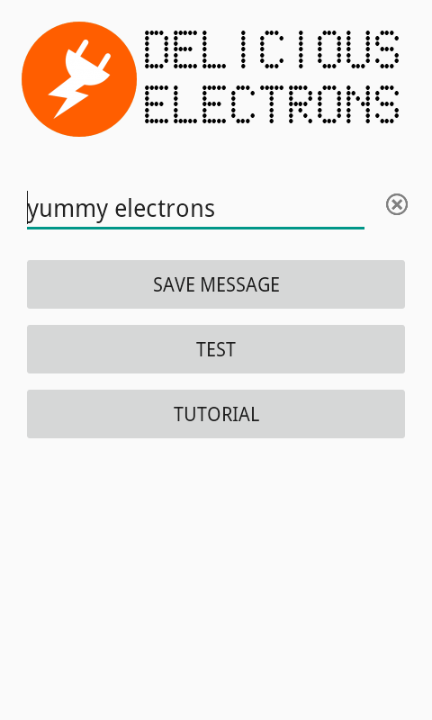
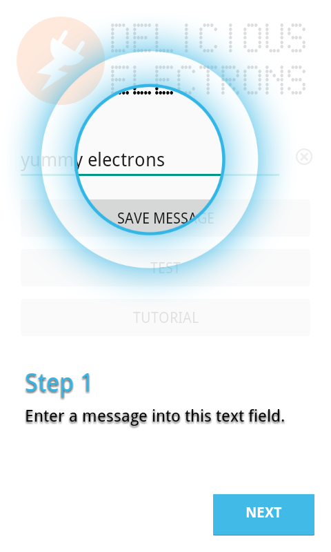

DeliciousElectrons
==================

This app is an updated version of <a href="https://github.com/ChrisRBateman/PowerConnectedDemo">PowerConnectedDemo</a>.
Updated the GUI, fixed some bugs and added <a href="https://github.com/amlcurran/ShowcaseView">ShowcaseView</a> code 
in a separate module. The ShowcaseView code is few years old but still works with current Android versions.  
  
Written in <b>Java</b> using Android Studio 3 and tested on Android 4.4.4, 5.1.1 and 7.0 devices.

  
